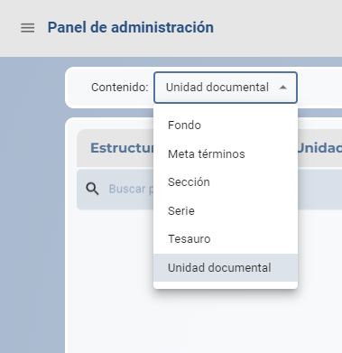

# Primeros pasos

## ¡Bienvenido!


¡Bienvenido al inicio de la aplicación! Actualmente, tienes un usuario con todos los permisos, lo que te da acceso completo al menú. Aprovechemos esta oportunidad para explorar todas las funcionalidades y familiarizarnos con la plataforma. ¡Vamos a echar un vistazo!

### Catalogación


Esta es nuestra pantalla principal, donde pasarás la mayor parte del tiempo navegando por los archivos. Es importante que te familiarices con su funcionamiento para aprovechar al máximo todas las funcionalidades. Vamos a explorar juntos cómo funciona y cómo puedes utilizarlo de manera eficiente.



En la esquina superior izquierda, encontrarás una lista desplegable con los tipos de contenido que vienen predefinidos con la instalación de ArchiHUB. Si quieres saber más sobre estos tipos de contenido, haz clic [aquí](estandares.md).

Es importante saber que los tipos de contenido tienen una jerarquía. Actualmente estamos viendo __Unidad Documental__ y su jerarquía asociada es la siguiente:

 ```
├── Fondo
│   ├── Unidad Documental
│   ├── Sección
│   │   ├── Unidad Documental
│   ├── Serie
│   │   ├── Unidad Documental
 ```

 Como puedes ver, la __Unidad Documental__ puede estar contenida en un __Fondo__, una __Sección__ o una __Serie__. Estos tipos, que llamaremos los padres de la __Unidad Documental__, aparecerán a la izquierda. Aunque ahora no hay nada, pronto comenzaremos a construir nuestro archivo. Las __unidades documentales__ se mostrarán en la parte derecha de la pantalla.

 Esta estructura te ayudará a organizar y navegar por tus archivos de manera efectiva. ¡Vamos a comenzar a construir tu archivo!


Para crear una nueva __Unidad Documental__, primero debemos crear un __Fondo__ que la contenga. Sigue estos pasos:

- Abrir el formulario de creación: Cuando abras por primera vez el formulario de creación, verás el formulario por defecto del ISAD-G.
- Rellenar el formulario: No te preocupes por todos los campos en este momento. Solo necesitas introducir un _Título_ para tu nuevo recurso de tipo __Fondo__.
- Guardar el __Fondo__: Una vez que hayas introducido el _Título_, puedes guardar tu nuevo recurso de tipo __Fondo__.

Ahora estás listo para crear __Unidades Documentales__ dentro de este __Fondo__. ¡Vamos a empezar!