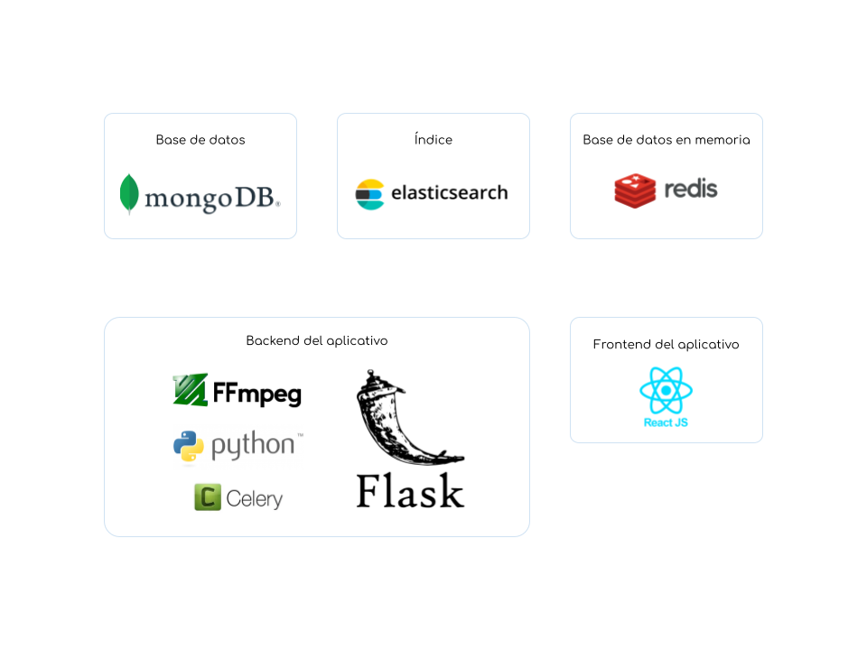

# Stack technológico y requerimientos

ArchiHUB es una plataforma web versátil que utiliza un stack technológico variado para ofrecerte una amplia gama de acciones sobre tus documentos.

## Stack technológico

- __Base de datos:__ Nos basamos en MongoDB, una base de datos no relacional altamente flexible. Esta elección nos permite adaptarnos a tus necesidades cambiantes en cuanto a los esquemas de metadatos.

- __Índice:__ El índice nos permite recuperar la información de forma rápida y eficiente. ArchiHUB se encarga de toda la organización y adaptación de los mapeos de elasticsearch.

- __Base de datos en memoria:__ Aprovechamos Redis para implementar un sistema de caché que ayuda a aliviar la carga en nuestra base de datos principal. Además, utilizamos Redis para gestionar una fila de procesos con Celery, lo que nos permite manejar tareas de manera eficiente y escalable.

- __Backend del aplicativo:__ El backend de nuestro aplicativo se beneficia de varios proyectos de código abierto. Utilizamos:
  &nbsp;&nbsp; - __FFmpeg__: para el procesamiento de archivos
  &nbsp;&nbsp; - __Celery__: para la gestión de la fila de procesamientos, permitiendo una ejecución distribuida y asíncrona de tareas.
  &nbsp;&nbsp; - __Flask y Gunicorn__: para poner en marcha el backend de forma paralela, asegurando una escalabilidad y rendimiento óptimos en todo momento.

- __Frontend del aplicativo:__ Nuestro aplicativo cuenta con un frontend desarrollado utilizando React.js.

## Requerimientos

| Tipo | Requerimientos | Comentarios |
| ----------- | ----------- | ----------- |
| Máquina local | - 8GB memoria RAM   - Tamaño en disco de acuerdo al contenido. Es importante tener en cuenta que ArchiHUB genera múltiples versiones de los archivos, además del original. Esto significa que el espacio requerido en disco puede variar según las versiones generadas y el tamaño de los originales.| Es importante destacar que en esta instalación, algunos plugins, como el de transcripción automática, pueden requerir recursos adicionales para ejecutarse correctamente. Sin embargo, puedes estar tranquilo sabiendo que para las funcionalidades de catalogación, recuperación y organización de archivos, no tendrás problemas gracias a los esfuerzos de optimización que hemos realizado. |
| Instalación en una infraestructura con varias máquinas | - __Dos (2)__ máquinas para el cluster de MongoDB   &nbsp;&nbsp; - Mínimo 16GB de RAM para cada una y 8 cores de CPU    - __Dos (2)__ máquinas para el cluster de Elasticsearch   &nbsp;&nbsp; - Mínimo 32GB de RAM para cada una y 16 cores de CPU. Ideal 64GB de RAM.    - __Una (1)__ máquina para el aplicativo   &nbsp;&nbsp; - 64GB de RAM y 32 cores de CPU. Esta máquina no solo se encarga de ejecutar el aplicativo en sí, sino también de manejar el caché y gestionar la fila de procesos. Dado que ejecutamos múltiples instancias del backend de forma paralela, es crucial contar con suficiente memoria RAM y potencia de CPU para manejar todas las solicitudes de manera eficiente.    - __Dos (2)__ máquinas para los procesamientos   &nbsp;&nbsp; - ArchiHUB brinda la posibilidad de separar filas de tareas dependiendo de la intensidad de las tareas a ejecutar. Esta configuración permite asignar una máquina para ejecutar una sola tarea al tiempo de alto nivel de intensidad mientras que la segunda se puede dejar con | |